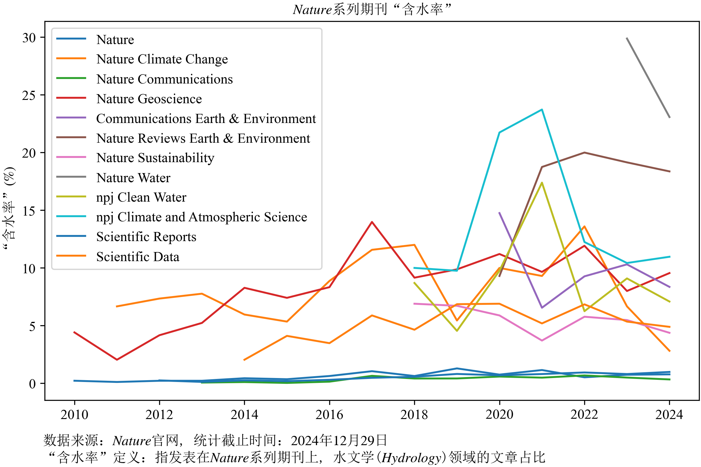

# nature_subjects
### 1 基本结果

分析以hydrology为主题，并发表在nature系列期刊上的文章数量，可将subject=hydrology指定为其他任意主题。其他主题可见：https://www.nature.com/subjects

可以发现，nature、nc、sr上，hydrology的文章都非常少。nc在2024年发表了超过10000+篇文章，但hydrology文章仅有34篇，比例不足4‰。考虑以上12本期刊，“含水率“仅为0.9%，剔除SR、SD、NW后，”含水率“为1.2%，真可谓”百里挑一“。

2010-2024，15年时间，12本期刊共发文311832篇文章，其中hydrology仅有2889篇。考虑到众多学科，水文学的贡献实在是低。

### 2 数据说明

- data中包括了获取的所有数据，包括文章标题，文章链接，发表日期等
- script中包括了获取源数据（包括获取所有文章标题、每本期刊每年刊发的文章数目、绘图程序）
- pic中是基本结果，wordcloud是根据2889篇文章标题生成的词云，词云未做仔细分析，有需要可以用data文件夹下的数据进行分析

### 3 未来计划

还有很多可以深入分析的地方，如获取通讯作者单位、国籍等信息，但目前nature在线文章给出的不太标准，难以统一获取，不知道有没有其他搜索工具。（web of science未包含hydrology类别）

- [ ] 获取文章摘要（这个可以做很多事情）

- [ ] 获取第一作者、通讯作者及其单位信息

- [ ] 统计Science、Science Advances、PNAS上文章

- [ ] 根据以上信息能写一篇关于水文学发展的综述，但不是我这个小透明能搞的😅

  ……